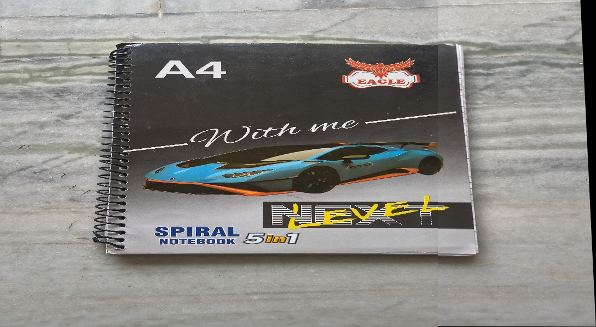

# 🖼️ Image Stitching & Panorama Creation

A Computer Vision project that automatically combines multiple overlapping images into a single seamless panoramic image using **ORB Feature Detection**, **BFMatcher**, **RANSAC Homography**, and **Perspective Warping**.

---

## 📌 Overview

Image stitching is a technique used to merge multiple overlapping images into a wider field-of-view image called a **panorama**.

This project implements a complete image stitching pipeline using OpenCV and demonstrates key computer vision concepts such as:

* Feature Detection
* Feature Matching
* Homography Estimation
* Perspective Transformation
* Panorama Generation

---

## 🚀 Features

✅ ORB Feature Detection

✅ BFMatcher Feature Matching

✅ RANSAC Outlier Removal

✅ Homography Matrix Estimation

✅ Perspective Warping

✅ Automatic Panorama Generation

✅ Visualization of Feature Correspondences

---

## 🛠️ Technologies Used

* 🐍 Python
* 👁️ OpenCV
* 🔢 NumPy
* 📊 Matplotlib

---

## ⚙️ Algorithm Workflow

### 1. Load Images

Read overlapping input images.

### 2. Convert to Grayscale

Prepare images for feature extraction.

### 3. Detect ORB Features

Extract keypoints and descriptors from both images.

### 4. Match Features

Match descriptors using BFMatcher.

### 5. Estimate Homography

Use RANSAC to remove outliers and compute the transformation matrix.

### 6. Warp Images

Apply perspective transformation to align images.

### 7. Generate Panorama

Merge aligned images into a seamless panorama.

---

## 📂 Project Structure

```text
Image-Stitching-Panorama/
│
├── images/
│   ├── img1.jpg
│   └── img2.jpg
│
├── Output/
│   └── final_panorama.jpg
│
├── stitch.py
├── Project_Report.pdf
└── README.md
```

---

## 📈 Results

| Metric                  | Value      |
| ----------------------- | ---------- |
| ORB Keypoints (Image 1) | ~3000      |
| ORB Keypoints (Image 2) | ~3000      |
| Good Feature Matches    | ~825       |
| Homography Estimation   | Successful |
| Panorama Generation     | Successful |

---

## 🖼️ Output

### Final Panorama



---

## ▶️ How to Run

### Install Dependencies

```bash
pip install opencv-python numpy matplotlib
```

### Run the Program

```bash
python stitch.py
```

---

## 🎯 Learning Outcomes

* Feature Detection using ORB
* Feature Matching Techniques
* Homography Estimation
* RANSAC Algorithm
* Perspective Warping
* Panorama Stitching
* OpenCV Image Processing

---

## 🌍 Applications

* Virtual Tours
* Panoramic Photography
* Drone Mapping
* Satellite Image Mosaicing
* Robotics and Computer Vision

---

## 📄 Project Report

Detailed project documentation is available in:

```text
Project_Report.pdf
```

---

## 👨‍💻 Author

**Sachin Tomar**

B.Tech Mathematics & Computing
National Institute of Technology Kurukshetra

---

⭐ If you found this project useful, consider giving it a star!
